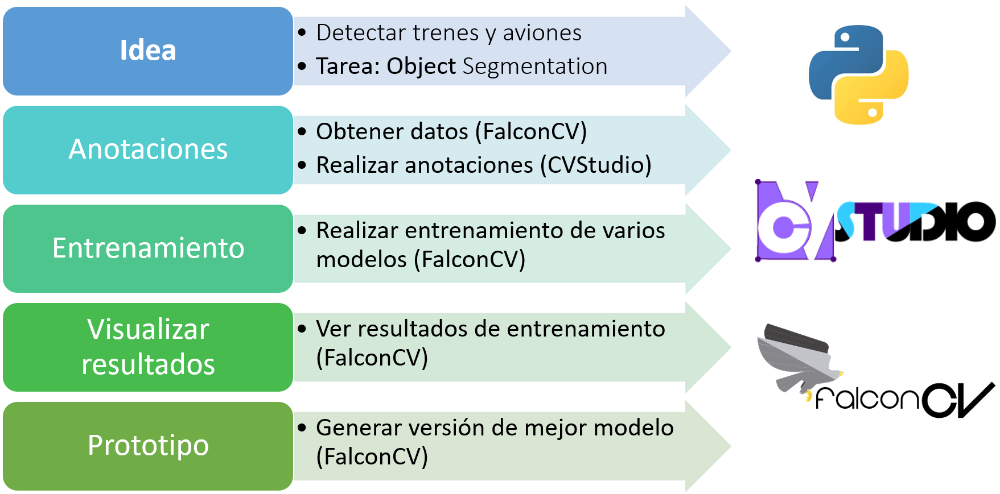

# Proyecto Computer Vision End-to-End

Proyecto Deep Learning para Computer Vision (DL4CV) para meetup CaliSharp.

# DEMO

## Instalación

- Para instalar **FalconCV** seguir los [siguientes](https://github.com/haruiz/FalconCV#installation) pasos.
- Para instalar **CVStudio** seguir los [siguientes](https://github.com/haruiz/CvStudio#installation) pasos.

## Ejecución

- [Jupyter Notebook](object-segmentation-demo.ipynb)
- 

# Autores

- [Henry Ruiz](https://github.com/haruiz).
- [David Lopera](https://github.com/dloperab).

# Licencia

[MIT license](LICENSE)
